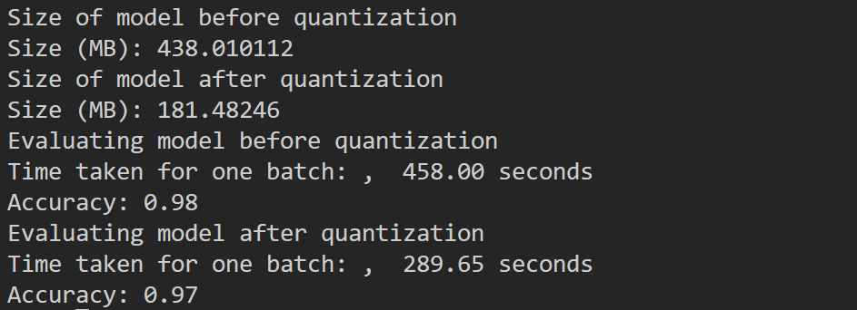

## Project Overview

This repository provides end-to-end pipelines for fine-tuning BERT on a custom text classification dataset, performing knowledge distillation to a smaller “DistilBERT” model, and applying dynamic post-training quantization to reduce model size and inference time.

* **Fine-tuning**: Uses Hugging Face’s `Trainer` API to adapt `bert-base-uncased` on a CSV dataset with `Text` and `Label` columns.
* **Distillation**: Trains a custom DistilBERT implementation (in `distillbert.py`) to mimic a larger BERT teacher model’s outputs via KL-divergence loss.
* **Quantization**: Applies PyTorch dynamic quantization to the fine-tuned BERT and measures size and latency improvements.

---

## Table of Contents

* [Installation](#installation)
* [Data Preparation](#data-preparation)
* [Usage](#usage)

  * [1. Fine-tuning (`finetuning.py`)](#1-fine-tuning-finetuningpy)
  * [2. Distillation (`distillation.py` + `distillbert.py`)](#2-distillation-distillationpy--distillbertpy)
  * [3. Quantization (`quantization.py`)](#3-quantization-quantizationpy)
* [Project Structure](#project-structure)
* [Requirements](#requirements)
* [Contributing](#contributing)
* [License](#license)

---

## Installation

1. **Clone the repository**

   ```bash
   git clone https://github.com/lavanderhoney/bert-distillation-quantization.git
   cd bert-distillation-quantization
   ```

2. **Create & activate a Python virtual environment**

   ```bash
   python3 -m venv venv
   source venv/bin/activate
   ```

3. **Install dependencies**
   > ```bash
   > pip install torch transformers datasets evaluate pandas scikit-learn tqdm
   > ```

---

## Dataset

The dataset, `df_file.csv` is taken from Kaggle: https://www.kaggle.com/datasets/sunilthite/text-document-classification-dataset?select=df_file.csv
---

## Usage

### 1. Fine-tuning (`finetuning.py`)

Fine-tune the `bert-base-uncased` model on your dataset:

```bash
python finetuning.py
```

* Reads `df_file.csv`, splits into train/test (80/20)
* Tokenizes with `BertTokenizerFast`
* Uses Hugging Face `Trainer` for 5 epochs, saving outputs to `outputs/` and `files/models/bert_finetuned.

Finetuning training results:

---

### 2. Distillation (`distillation.py` & `distillbert.py`)

Train a smaller DistilBERT student to mimic the fine-tuned teacher:

```bash
python distillation.py
```

* Loads `df_file.csv` and tokenizes with `BertTokenizer`
* Defines a custom DistilBERT architecture in `distillbert.py` (6 layers, multi-head attention, MLP blocks, based on the original DistillBERT paper).
* Uses KL-divergence + cross-entropy loss to perform response based knowledge distillation from teacher to student over 8 epochs
* Saves the distilled student model to `files/models/student_model.pt`.
* Usually, to distill a teacher model, we would begin with a pretrained model, and then perform the distillation process. Here, I have not done that, since my main focus was to learn about knowledge distillation and architecture of BERT.

Distillation training results:

---

### 3. Quantization (`quantization.py`)

Apply PyTorch dynamic post-training quantization to the fine-tuned teacher:

```bash
python quantization.py
```
* Loads the saved teacher from `milapp857/bert-finetuned-txt-classification` by default
* Prints model size before & after quantization
* Measures inference time and accuracy on the test split.

These are the quantization results: 

---

## Saved Models

The models created here are saved on HuggingFace hub:
* BERT fine-tuned model: https://huggingface.co/milapp857/bert-finetuned-txt-classification/tree/main
* Distilled BERT model: https://huggingface.co/milapp857/distill-bert-txt-classification
* Quantized BERT (original) model: https://huggingface.co/milapp857/quantized-bert-models/tree/main

